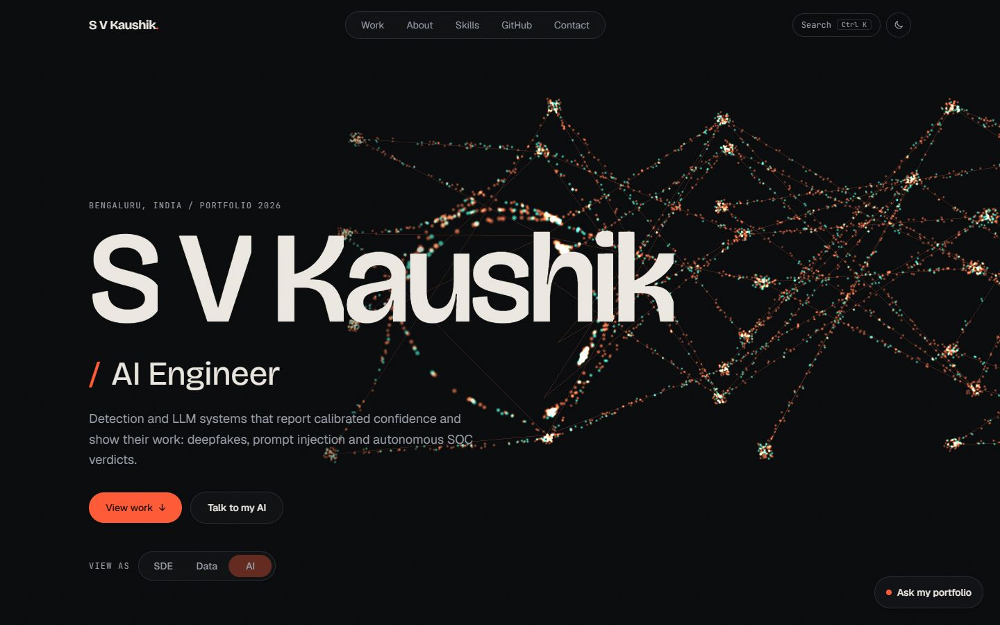
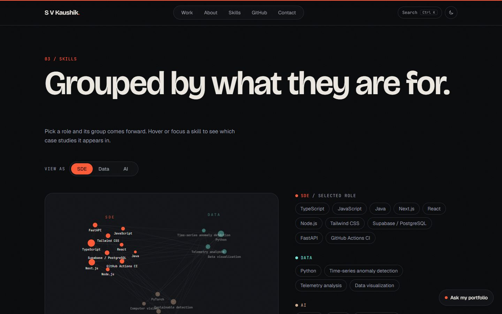
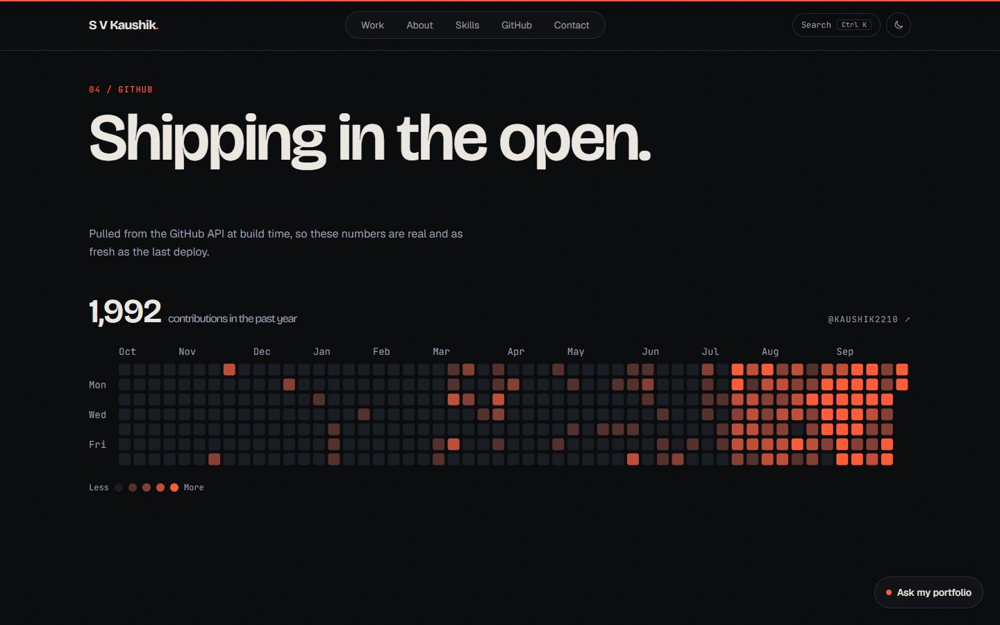
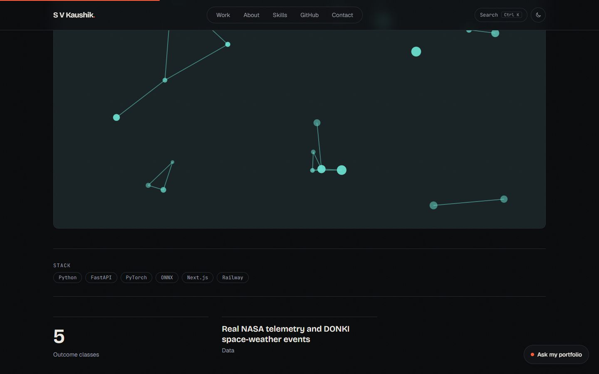

# S V Kaushik: portfolio

Personal portfolio for software, data and AI engineering roles. A 3D hero, a
role switcher that re-orders the whole site, case studies with shared-element
transitions, live GitHub data, and an assistant that answers only from the real
work.

**Live:** https://portfolio-general-ten.vercel.app

|                                        |                                                |
| -------------------------------------- | ---------------------------------------------- |
|      |          |
|  |  |

## What is in it

- **Hero**: a custom GLSL particle field that resolves from noise into a neural-network lattice, reacts to the cursor and dissolves on scroll. Phones, touch devices, reduced-motion and low-power machines get a static SVG version of the same layout instead of WebGL.
- **Role switcher** (`View as: SDE | Data | AI`): re-orders projects (GSAP Flip), re-weights skills, and changes the hero copy and scene tint. Until you pick a role the hero previews all three.
- **Work**: pinned horizontal gallery on desktop, plain grid elsewhere. Each project has a case-study route (problem, approach, result, architecture) with a shared-element cover transition via React `<ViewTransition>`.
- **Skills**: an interactive constellation (hover or focus a skill to light the projects that use it), with the same content as a plain accessible list.
- **GitHub**: contribution heatmap, language share and recent activity from `data/github.json`, refreshed by `npm run sync`.
- **Ask my portfolio**: streaming chat grounded in the data files, with a fit-check mode for pasting a job description. Falls back to data-derived answers when no API key is set.
- **Maximalist styling**: saturated colour blocks (ember, teal, violet, lime, pink), two tilted tape-style marquee bands crossing the page, a rotating sticker badge, HUD coordinates and ghost outlined type in the hero, giant section numerals, a dot-grid texture, hard offset-shadow cards with numbered stickers, and colour-block stat tiles. The paint-heavy pieces (ghost type, numerals, dot grid, second band, tile tilts, endless marquee tweens) switch off on phones.
- **3D effects**: the hero particle field now has a spinning wireframe icosahedron core and a click shockwave that ripples outward through the lattice (a GLSL ring expanding from where you clicked); a draggable CSS-3D skill carousel you can fling with momentum (tablet and up); cards and stat tiles tilt in 3D with a following glare; section headings tip up out of a perspective mask; the footer wordmark tips up from the floor as you scroll; the role title scrambles into place when you switch role.
- **Motion layer**: a scroll-velocity marquee that speeds up, reverses and skews with your scroll; kinetic split-text headings; scramble-in section labels; 3D card tilt with a following glare; a gallery progress counter; hero depth parallax against the pointer; an ambient colour field that travels with scroll; contextual cursor labels. GSAP (ScrollTrigger, SplitText, ScrambleText, Flip) drives these, and anime.js drives the nav indicator that slides to the hovered or active section, click ripples, skill-chip waves on role change, and the drawn architecture connectors. Every one is skipped for reduced-motion, and pointer-driven ones for touch.
- **Command palette** (`Ctrl/Cmd+K`), **terminal mode** (`~`), contact form (server action, Resend), dark/light theme, custom cursor, scroll progress, 404 page.

## Stack, and where it deviates from the brief

Next.js 16 (App Router) with TypeScript (strict) and Tailwind CSS v4, deployed on Vercel. GSAP (ScrollTrigger, SplitText, Flip) drives scroll choreography with Lenis wired to its ticker. anime.js v4 handles the preloader, counters and SVG staggers. Three.js through React Three Fiber renders the hero. `cmdk` powers the palette. The Anthropic SDK streams the chat.

Deviations, on purpose:

| Brief                                   | What I did                              | Why                                                                                                                         |
| --------------------------------------- | --------------------------------------- | --------------------------------------------------------------------------------------------------------------------------- |
| `motion/react` for presence transitions | Not used                                | React's native `<ViewTransition>` and GSAP covered every case; an unused dependency is dead weight.                         |
| shadcn/ui primitives                    | `cmdk` directly plus hand-built dialogs | `cmdk` is what shadcn's Command wraps. The dialogs need a focus trap and Lenis scroll isolation, which were simpler to own. |
| React Bits components                   | Not used                                | The hero is a custom shader; I did not want the stock React Bits look.                                                      |
| `@react-three/drei`                     | Not used                                | The scene needs only R3F and a hand-written material.                                                                       |
| Mobile 3D                               | CSS/SVG fallback                        | Brief asked for a fallback on mobile and low-power devices.                                                                 |
| Preloader                               | Desktop only, once per session          | On phones it delayed content and cost main-thread time on the slowest hardware.                                             |

## Architecture

```
app/                    routes, metadata, sitemap, robots, OG image, /api/chat
components/
  hero/                 scene (R3F + shaders), SVG fallback, hero copy and timeline
  work/ about/ skills/ github/ contact/ footer/    page sections
  chat/ palette/ terminal/                          lazy-loaded overlays
lib/
  data.ts               typed access to data/*.json
  motion/               GSAP setup, shared easings and durations, Lenis helpers
  prefs.ts store.ts     theme and role stores (useSyncExternalStore, no effects)
  chat/                 grounded system prompt, static FAQ
  ratelimit.ts          Upstash limiter with in-memory fallback
data/                   github.json (synced), linkedin.json, projects.json
scripts/                sync-data.ts, check-content.ts
design/tokens.md        colour, type, spacing and motion language
docs/                   research, content TODOs, screenshots
```

Design reasoning is in `docs/design-research.md` and `design/tokens.md`. Motion rules (easings, durations, stagger caps) live in `lib/motion/tokens.ts` and mirror the CSS variables.

## Run it

```bash
npm install
cp .env.example .env.local     # add keys you have; the site degrades without them
npm run dev
```

| Script                                  | What it does                                                                                |
| --------------------------------------- | ------------------------------------------------------------------------------------------- |
| `npm run dev` / `build` / `start`       | Next.js                                                                                     |
| `npm run lint` / `typecheck` / `format` | ESLint, `tsc --noEmit`, Prettier                                                            |
| `npm run sync`                          | Refresh `data/github.json` from the GitHub API                                              |
| `npm run check:content`                 | Validate the data files and list every unverified field (`-- --strict` fails if any remain) |

Husky + lint-staged format and lint staged files on commit. CI (`.github/workflows/ci.yml`) runs lint, typecheck, build and Lighthouse CI.

## Environment variables

| Variable                                                   | Needed for                                                                                                  |
| ---------------------------------------------------------- | ----------------------------------------------------------------------------------------------------------- |
| `ANTHROPIC_API_KEY`                                        | The chat. Without it the panel shows the offline state.                                                     |
| `ANTHROPIC_MODEL`                                          | Optional. Defaults to `claude-sonnet-5-5`.                                                                  |
| `RESEND_API_KEY`, `CONTACT_TO_EMAIL`, `CONTACT_FROM_EMAIL` | The contact form. Without a key it tells visitors to email directly.                                        |
| `UPSTASH_REDIS_REST_URL`, `UPSTASH_REDIS_REST_TOKEN`       | Optional shared rate limiting. Falls back to in-memory per instance.                                        |
| `GITHUB_TOKEN`                                             | Optional for `npm run sync` (it also uses `gh auth token` if available). Enables the contribution calendar. |
| `NEXT_PUBLIC_SITE_URL`                                     | Optional canonical origin. Falls back to Vercel's production URL.                                           |

Never commit `.env.local`. Only `.env.example` is tracked.

## Updating the content

- **GitHub numbers**: `npm run sync`, commit `data/github.json`, deploy.
- **Experience, education, certifications, achievements**: fill `data/linkedin.json`. Every value that is still `"TODO_VERIFY"` is hidden from the site rather than shown. Run `npm run check:content` for the live list, and see `docs/TODO-content.md`.
- **Projects**: edit `data/projects.json`. `weight.sde/data/ai` (0 to 1) controls ordering in each role view. Put screenshots in `public/projects/` and set `visual`.
- **Resume**: add `public/resume.pdf` and the Resume button and palette entry appear. Add `data/resume.txt` (plain text) to let the assistant answer from it too.

LinkedIn cannot be scraped (login wall and terms), so nothing here came from it. The skills list is evidenced by the public repos only.

## The assistant

`app/api/chat/route.ts` streams from the Anthropic API.

- **Grounding**: the system prompt is built from `data/*.json` (with every `TODO_VERIFY` and `TODO_SCREENSHOT` stripped) and the optional resume text. It must answer only from that and otherwise reply "I don't have that information; you can email ...".
- **Guardrails**: off-topic requests are declined, the prompt and context are never revealed, pasted job descriptions are fenced as untrusted data, and a decline from the model is shown as a plain refusal.
- **Limits**: 20 turns, 1,500 characters per message (6,500 for a job description), 12 requests per 10 minutes per client. The client key is a hash of the IP, nothing is logged.
- **Offline**: with no key, `GET /api/chat` reports `available: false` and the panel shows answers built from the same data.
- **Tested** against a local mock that speaks the streaming protocol (validation, fencing, rate limit, request shape). It has **not** been exercised against the live API, because no key was available while building.

## Performance, accessibility, SEO

Measured with Lighthouse 12.6.1 against the production deployment, default simulated throttling.

| Page       | Preset  | Performance    | Accessibility | Best practices | SEO |
| ---------- | ------- | -------------- | ------------- | -------------- | --- |
| Home       | Mobile  | 73, 85, 87, 87 | 100           | 100            | 100 |
| Home       | Desktop | 96             | 100           | 100            | 100 |
| Case study | Mobile  | 91             | 100           | 100            | 100 |

Measured again after the motion layer and the maximalist styling were added. Accessibility, best practices and SEO are 100 everywhere and desktop clears 90, but **mobile home sits under the performance target (typically 85 to 87, with occasional outliers either side)**; the maximalist and 3D layers cost roughly 5 mobile points, which is the trade for the look. Cutting more of it on phones would close the gap; desktop and case studies have headroom, the home page on mobile is the tightest at 91 to 92. Getting the home page there took several rounds, and what the investigation found is worth keeping:

- Under real CPU throttling, the dominant cost was one synchronous React hydration task. About 55% of the first-load DOM was decorative SVG (heatmap cells, tooltips, cover art), so those now mount only as they near the viewport. First-load DOM went from 2,065 to 838 nodes and mobile TBT in my 4x-CPU harness from about 2.0s to 0.4s. Lazily mounting the skills graph (never mounted on phones, where it is hidden) took the home page from 62-76 to 91-92.
- Splitting sections into `<Suspense>` slices made production worse (TBT up to 1.7s), so it was reverted.
- The simulated LCP stays around 3.4s even though the observed paint is early. Hypotheses I tested and ruled out: the preloader overlay, hydration replacing DOM nodes, and font-display.
- Remaining cost is mostly the first layout pass and the framework bundle.

Other measures: Lenis and ScrollTrigger are torn down with `gsap.context`, all 3D and the chat, palette and terminal are code-split and lazy, the 3D loop pauses off-screen and when the tab is hidden, DPR is capped at 1.5, `prefers-reduced-motion` swaps scrubbed motion for plain fades and disables the shader, and the site is fully keyboard-operable with visible focus.

## Deployment

```bash
npx vercel link --yes --project portfolio-general
npx vercel deploy --prod --yes
```

GitHub auto-deploy needs a Login Connection for GitHub on the Vercel account, which only the account owner can add. Until then, deploy from the CLI. Add the environment variables above in the Vercel dashboard.

## Known gaps

- Every case study uses generated cover art because screenshots are still `TODO_SCREENSHOT`.
- No `public/resume.pdf` yet.
- Experience, education, certifications and achievements are empty until `data/linkedin.json` is filled, so the timeline and some About counters are hidden.

## Responsive behaviour

Checked at 360, 390, 768, 1024 and 1440 px: no horizontal overflow and no tap targets under 32 px at any size. Decoration is tiered: phones get the content and a static hero; tablets add the sticker, skill carousel and tilt-free layout; desktops with a mouse add tilt, parallax, the cursor ring, the pinned gallery and the WebGL scene. Pointer-driven effects set themselves up on first hover, so touch devices pay nothing for them.
